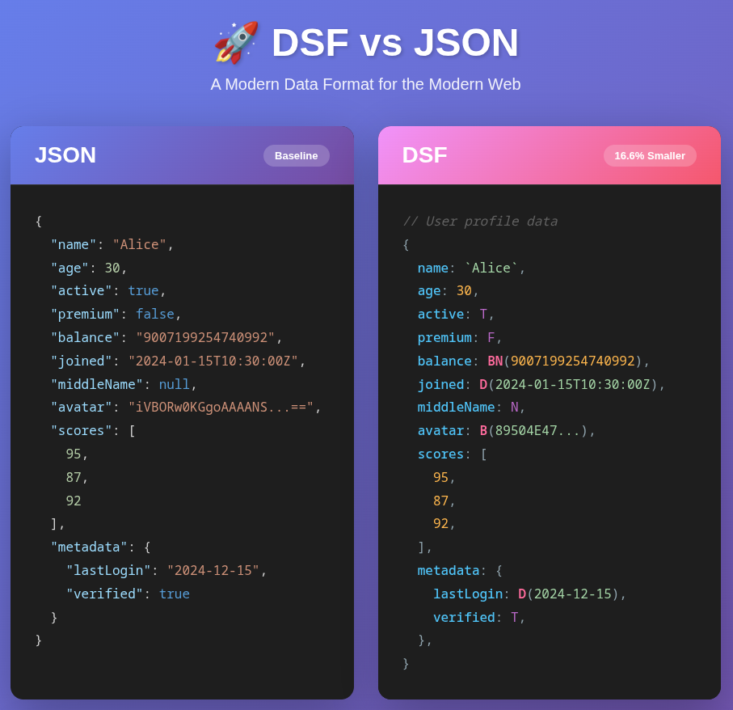

# DSF — Data Structure Format

A project of the [Open Tech Foundation](https://github.com/Open-Tech-Foundation).

> [!CAUTION]
> **EXPERIMENTAL PRE-RELEASE**
>
> DSF is currently in an experimental, pre-release state. The specification and implementations provided here are for research and feedback purposes only. APIs and document grammar are subject to breaking changes.

## Overview

>**DSF (Data Structure Format)** is a human-readable, structured data format designed for configuration and data interchange. It emphasizes predictability, fast parsing, and explicit typing via constructor literals.

### Key Features

- **Unquoted Keys**: Clean, minimal syntax.
- **Backtick Strings**: No more escaping double quotes.
- **Explicit Literals**: `T`, `F`, `N` for True, False, and Null.
- **Constructor Literals**: Native support for Dates `D()`, BigNumbers `BN()`, and Binary `B()`.
- **Single-line Comments**: Use `//` for notes and documentation.
- **Fast Parsing**: Designed for direct byte-level processing.

## Documentation

-   [DSF 1.0 Specification (Draft)](doc/spec.md)
-   [Comparison with Other Formats](doc/comparison.md)

## Reference Implementations

The `ref-impl/` directory contains reference implementations for various languages:

-   [Python](ref-impl/python/)
-   [TypeScript](ref-impl/ts/)
-   [Go](ref-impl/go/)
-   [Rust](ref-impl/rs/)

## 📊 Benchmark Results

DSF consistently achieves a **reduced payload size** (16%–20%) compared to JSON. Most notably, optimized DSF implementations can **outperform native JSON parsers** in speed.

### Key Metrics (30,000 entries)

| metric | language | JSON | DSF | difference |
| :--- | :--- | :--- | :--- | :--- |
| 📏 **Payload Size** | Go | 6.28 MB | 5.13 MB | 📉 **-18.3%** |
| | Rust | 6.45 MB | 5.13 MB | 📉 **-20.5%** |
| | TypeScript | 6.28 MB | 5.25 MB | 📉 **-16.5%** |
| | Python | 7.08 MB | 5.93 MB | 📉 **-16.2%** |
| ⏱️ **Parsing Time** | Go | 99.6 ms | 63.2 ms | 🚀 **37% faster** |
| | Rust | 72.2 ms | 47.1 ms | 🚀 **35% faster** |
| | TypeScript | 33.8 ms | 321.5 ms | 9.5x slower |
| | Python | 94.8 ms | 84.7 ms | 🚀 **10% faster** |
| ✍️ **Serialization**| Go | 104.0 ms | 44.4 ms | 🚀 **57% faster** |
| | Rust | 15.4 ms | 23.2 ms | 1.5x slower |
| | TypeScript | 15.4 ms | 104.4 ms | 6.8x slower |
| | Python | 76.4 ms | 204.0 ms | 2.7x slower |

> [!NOTE]
> TypeScript benchmarks compare the DSF reference implementation against **Bun's native JSON library**.

## License

This project is dedicated to the public domain under the [CC0 1.0 Universal (CC0 1.0) Public Domain Dedication](LICENSE).
