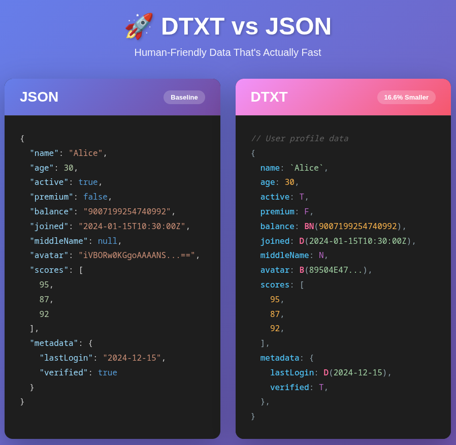

# DTXT — Data Text Format

A project of the [Open Tech Foundation](https://github.com/Open-Tech-Foundation).

**[🚀 Try the DTXT Playground](https://open-tech-foundation.github.io/DTXT/)**

> [!CAUTION]
> **EXPERIMENTAL PRE-RELEASE**
>
> DTXT is currently in an experimental, pre-release state. The specification and implementations provided here are for research and feedback purposes only. APIs and document grammar are subject to breaking changes.

## Overview

>**DTXT (Data Text Format)** is a human-readable, structured data format designed for configuration and data interchange. It emphasizes predictability, fast parsing, and explicit typing via constructor literals.

### Key Features

- **Unquoted Keys**: Clean, minimal syntax.
- **Backtick Strings**: No more escaping double quotes.
- **Explicit Literals**: `T`, `F`, `N` for True, False, and Null.
- **Constructor Literals**: Native support for Dates `D()`, BigNumbers `BN()`, and Binary `B()`.
- **Single-line Comments**: Use `//` for notes and documentation.
- **Fast Parsing**: Designed for direct byte-level processing.

## Documentation

-   [DTXT 1.0 Specification (Draft)](doc/spec.md)
-   [Migration Guide (JSON → DTXT)](doc/migration-guide.md)
-   [Edge Cases & Constraints](doc/edge-cases.md)
-   [Standardized Error Codes](doc/error-codes.md)
-   [Comparison with Other Formats](doc/comparison.md)

## Testing

-   [Conformance Test Suite](tests/conformance/tests.json)

## Reference Implementations

The `ref-impl/` directory contains reference implementations for various languages:

-   [Python](ref-impl/python/)
-   [TypeScript](ref-impl/ts/)
-   [Go](ref-impl/go/)
-   [Rust](ref-impl/rs/)

## 📊 Benchmark Results

DTXT consistently achieves a **reduced payload size** (16%–20%) compared to JSON. Most notably, optimized DTXT implementations can **outperform native JSON parsers** in speed.

### Key Metrics (30,000 entries)

| metric | language | JSON | DTXT | difference |
| :--- | :--- | :--- | :--- | :--- |
| 📏 **Payload Size** | Go | 6.31 MB | 5.16 MB | 📉 **-18.2%** |
| | Rust | 6.31 MB | 5.33 MB | 📉 **-15.5%** |
| | TypeScript | 6.31 MB | 5.28 MB | 📉 **-16.4%** |
| | Python | 7.11 MB | 5.96 MB | 📉 **-16.2%** |
| ⏱️ **Parsing Time** | Go | 90.6 ms | 67.6 ms | 🚀 **25% faster** |
| | Rust | 72.2 ms | 50.8 ms | 🚀 **30% faster** |
| | TypeScript | 40.0 ms | 326.1 ms | 8.1x slower |
| | Python (Rust Ext)| 102.5 ms | 93.4 ms | 🚀 **9% faster** |
| ✍️ **Serialization**| Go | 103.8 ms | 49.2 ms | 🚀 **52% faster** |
| | Rust | 15.4 ms | 37.5 ms | 2.4x slower |
| | TypeScript | 24.5 ms | 178.1 ms | 7.2x slower |
| | Python | 77.3 ms | 212.0 ms | 2.7x slower |

> [!NOTE]
> TypeScript benchmarks compare the DTXT reference implementation against **Bun's native JSON library**.

## License

This project is dedicated to the public domain under the [CC0 1.0 Universal (CC0 1.0) Public Domain Dedication](LICENSE).
